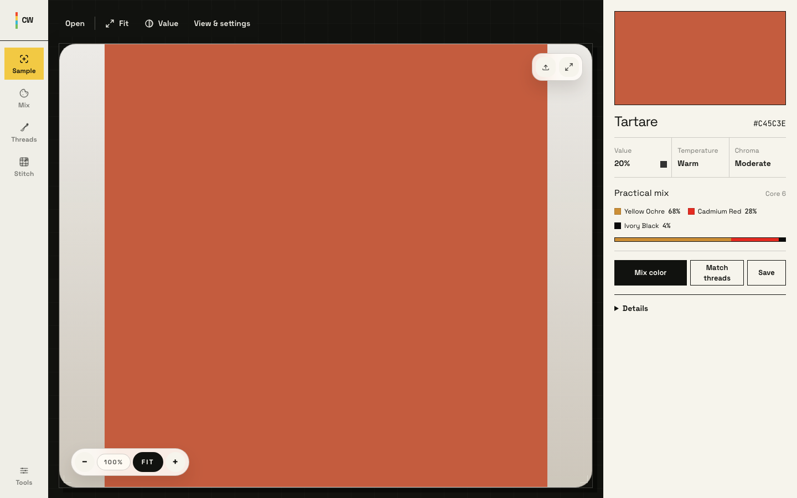
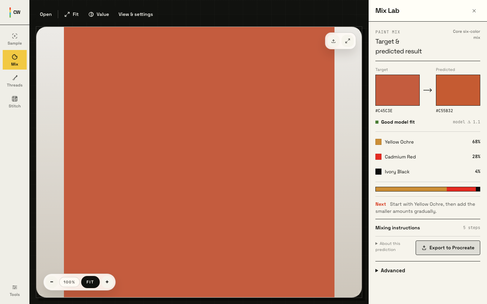

# ColorWizard

ColorWizard is a local-first color instrument for artists. Open a reference, sample a color, understand its character, then act with a practical paint mix, DMC thread match, or saved color.



The core journey is intentionally small:

1. **Open** a reference image.
2. **Sample** a color directly from the canvas.
3. **Understand** its value, temperature, and chroma.
4. **Act** by mixing paint, matching threads, or saving the color.

Images stay on your device. The core workflow does not require an account or cloud upload.

## Instrument Workbench Milestone

The current workbench is a major product simplification. The canvas and sampled color are now the visual center of the application, with technical depth available progressively instead of rendered as a dashboard by default.

- One canonical sample inspector replaces duplicate readouts and tutorial cards.
- Mix Lab leads with target, predicted result, fit, pigment ratios, and one proportional mix strand.
- Sample, Mix, Threads, and Stitch remain primary; secondary studio capabilities live under Tools.
- Mobile uses a canvas-first result sheet with collapsed, medium, and expanded states.
- The desktop project gallery is organized around New, Recent, Pinned, Palettes, and Settings.
- Browser and Tauri states share one warm-paper, black-stage, sample-driven visual system.



## What It Does

- Samples colors from local reference images.
- Shows HEX, RGB, HSL, perceptual name, value, chroma, and temperature readouts.
- Generates practical paint starting mixes for a limited palette.
- Finds close DMC embroidery floss matches.
- Supports value mode for grayscale/value-first painting decisions.
- Saves pinned/session colors locally.
- Provides Stitch planning and supporting studio tools through progressive disclosure.
- Includes a project gallery, local persistence, export, and licensing workflows in the desktop app.
- Runs in the browser and as a Tauri desktop app.

## Product Direction

ColorWizard is not a full creative suite. It is a focused bridge between reference images and physical making: **Open → Sample → Understand → Act**.

The workbench keeps Sample, Mix, Threads, and Stitch close at hand. Library, Reference, Structure, Surface, saved work, calibration, and infrequent settings remain available without competing with the canvas.

Paint mixes are starting points, not exact physical simulations. Paint brand, pigment load, surface, lighting, and technique still matter.

## Privacy

- Reference images are processed locally in the browser or desktop app.
- Core sampling, matching, and saving do not require uploading images.
- Pinned colors and local cards remain under user control.

## Tech Stack

- Next.js 15
- React 18
- TypeScript
- Tailwind CSS
- Zustand
- Canvas API
- Web Workers
- Spectral.js
- Tauri for desktop packaging

## Getting Started

```bash
npm install
npm run dev
```

Open [http://localhost:3000](http://localhost:3000).

If port 3000 is already in use, Next.js will choose another local port.

## Useful Commands

```bash
npm run lint
npx tsc --noEmit
npm test -- --run
npm run validate:paints
npm run build
```

Core browser smoke check:

```bash
COLORWIZARD_URL=http://localhost:3000 npm run smoke:core
```

The smoke check exercises upload, sample, paint mix, value mode, and Threads/DMC on desktop and mobile viewports. It expects a local dev server to already be running and requires Playwright to be available in the local environment.

## Desktop App

Tauri development:

```bash
npm run tauri:dev
```

Build a macOS DMG:

```bash
npm run tauri:build:dmg
```

The desktop app uses a static Next.js export for packaging. Code signing and notarization are still required for normal macOS distribution outside the App Store.

## Current Scope

In scope for the core instrument:

- Image upload
- Canvas sampling
- Practical paint starting mix
- DMC thread matches
- Value mode
- Local pinned/session colors
- Stitch planning
- Paint library and palette management
- Desktop projects, persistence, and export

Out of scope for the core instrument:

- Cloud-first project storage
- Social sharing
- Collaboration
- A full Photoshop/Procreate/Figma replacement
- Exact paint simulation claims

## Verification

The redesign is exercised at 1440×900, 1366×768, 768×1024, and 390×844. The automated suite covers the desktop and mobile Open → Sample → Mix → Value → Threads flow, alongside the color-science and persistence unit tests.

Before/after and responsive captures are stored in [`artifacts/ui-redesign`](artifacts/ui-redesign).

## Roadmap

- Deepen saved-color and export workflows without crowding the core journey.
- Continue refining iPad, easel, and couch use.
- Expand paint libraries and medium-specific palettes.
- Grow browser coverage around desktop persistence and advanced studio tools.

## Contributing

Keep changes sympathetic to the product shape: local-first, artist-facing, visual, and focused. Avoid adding broad suite-style features unless they strengthen Open → Sample → Understand → Act.
